

  

### Welcome to my GitHub Profile 👋

### My name is Facundo!

I love computers, coding, and music .

<h2> Tech Skills: </h2>
JavaScript - HTML - CSS - React - Redux  
NodeJS - Express - PostgreSQL - Sequelize  
Git - Babel - Webpack - Cloudinary - Bootstrap - JWT - Chatbot 

  <h2> Projects</h2>

    <h3>SoyHenry Pokédex</h3>
    🚀 Technologies used: 
    React - Redux - NodeJS - Express - PostgreSQL - Sequelize
    

      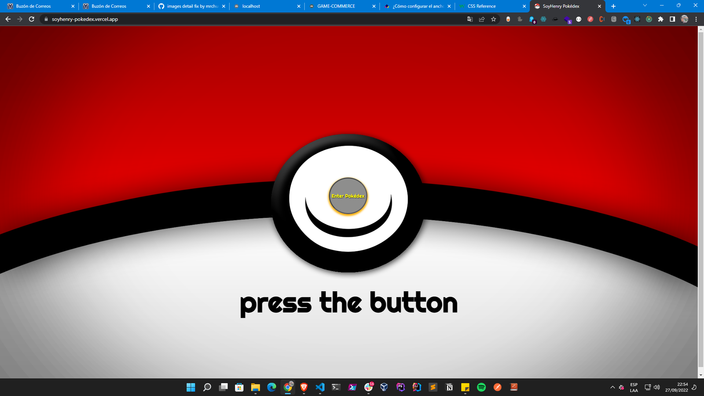
      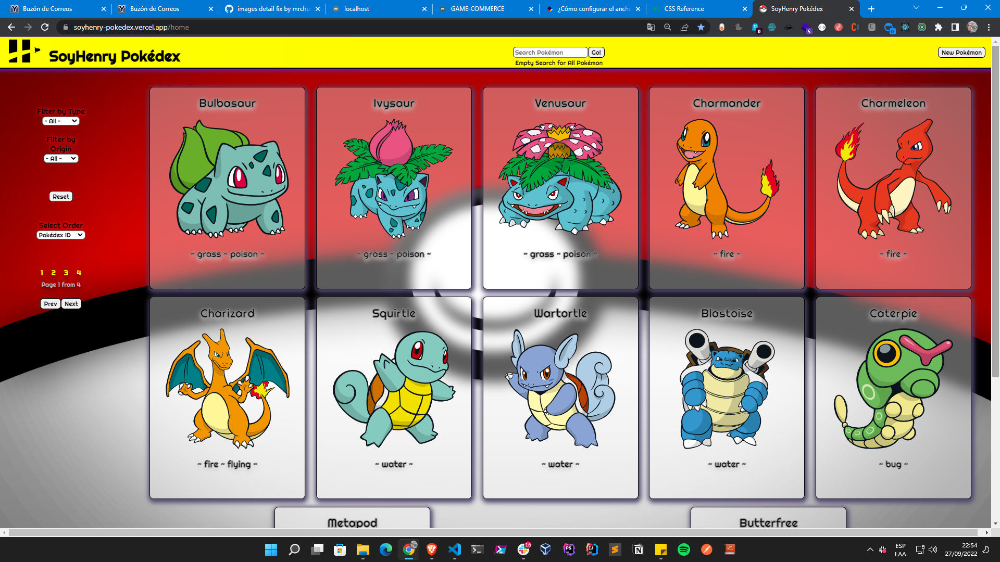
      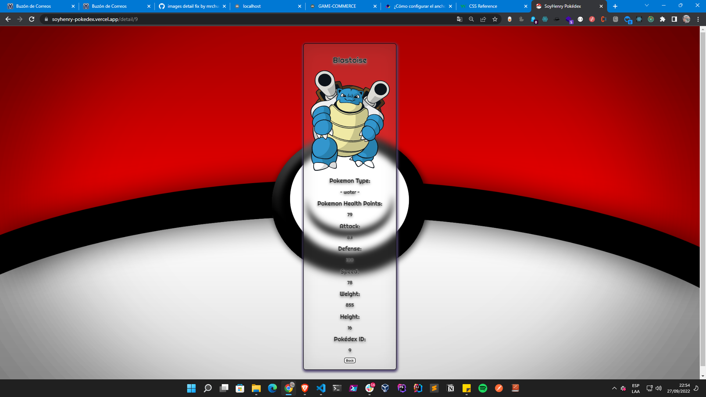
      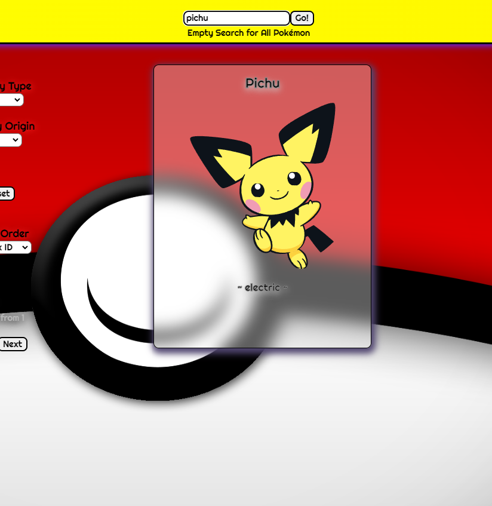
      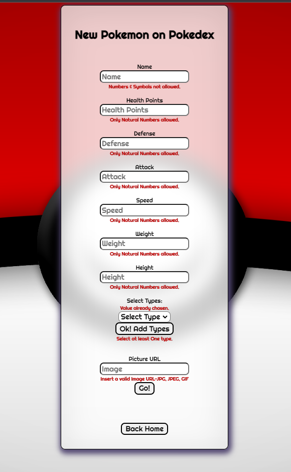
      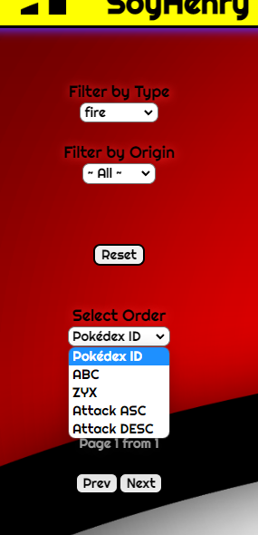
    

  

    <h3>GAME-COMMERCE</h3>
    App made with Henry's teammates as our final project.
      

      
      

    🚀 Technologies used: 
    React - Redux - NodeJS - Express - PostgreSQL - Sequelize - Bootstrap - JWT - Nodemailer - Cloudinary - MercadoPago Checkout Pro
    

      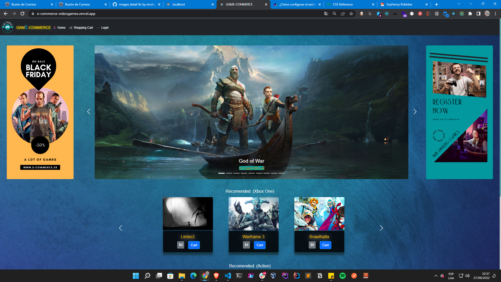
      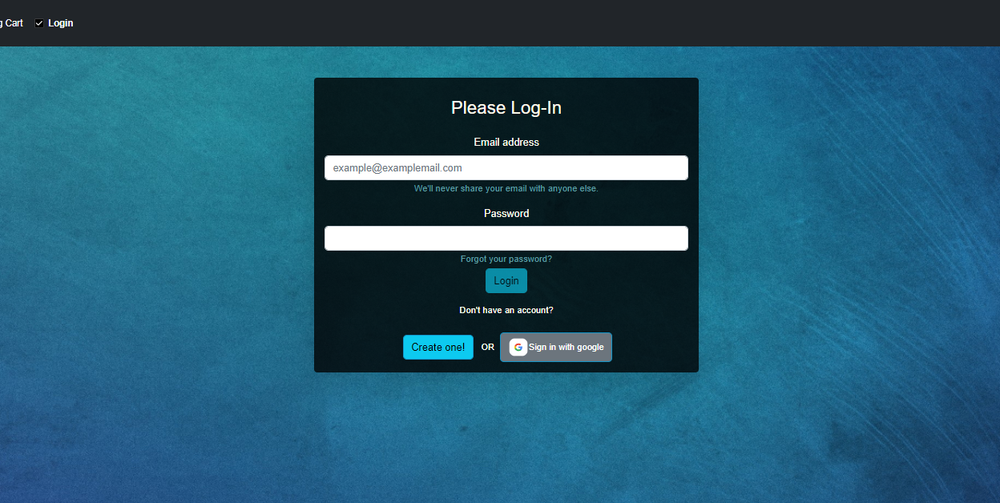
      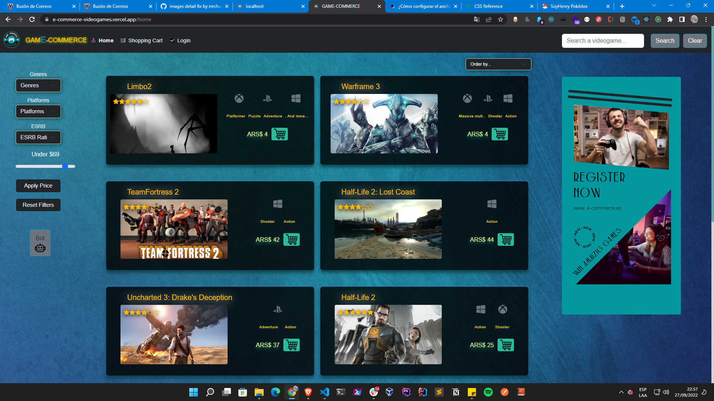
      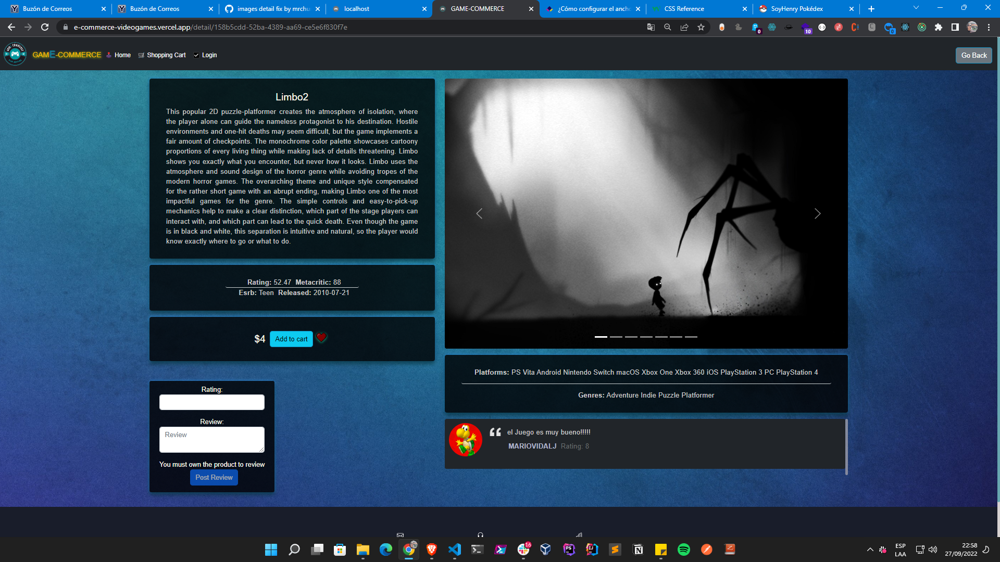
      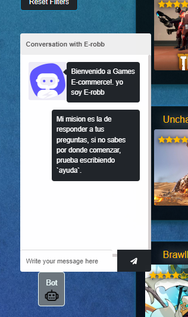
      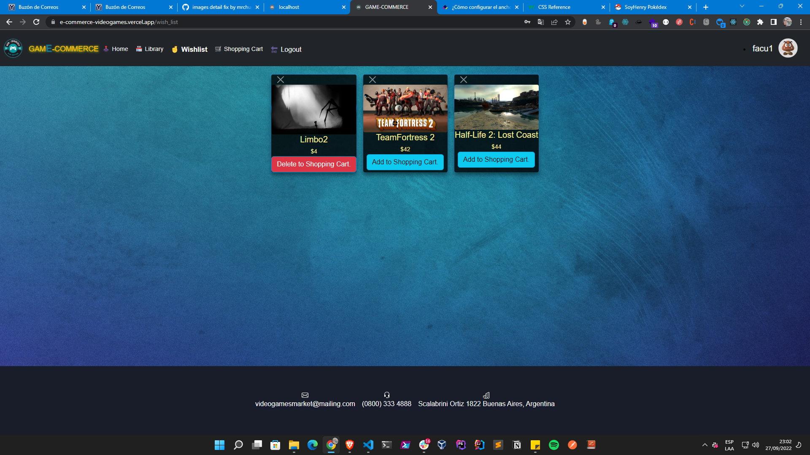
      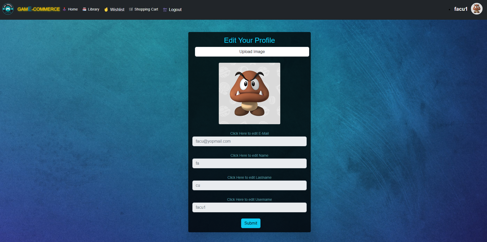
      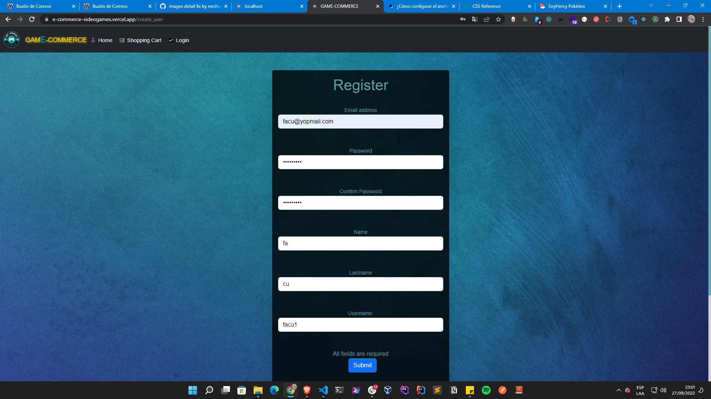
    

  

<h2> Contact me ></h2>

      
   

<!--
**facucorona** is a ✨ _special_ ✨ repository because its `README.md` (this file) appears on your GitHub profile.
Here are some ideas to get you started:
- 🔭 I’m currently working on ...
- 🌱 I’m currently learning ...
- 👯 I’m looking to collaborate on ...
- 🤔 I’m looking for help with ...
- 💬 Ask me about ...
- 📫 How to reach me: ...
- 😄 Pronouns: ...
- ⚡ Fun fact: ...
-->
