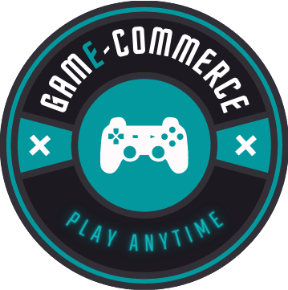
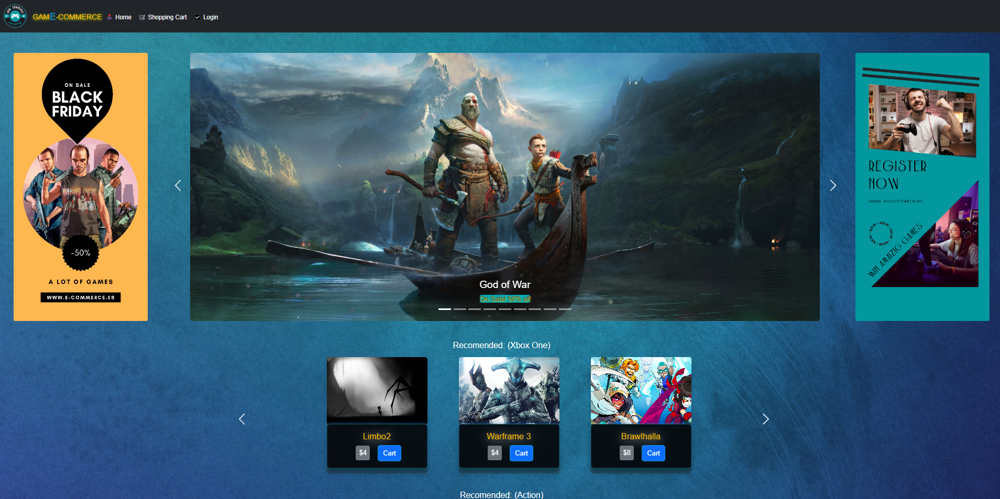
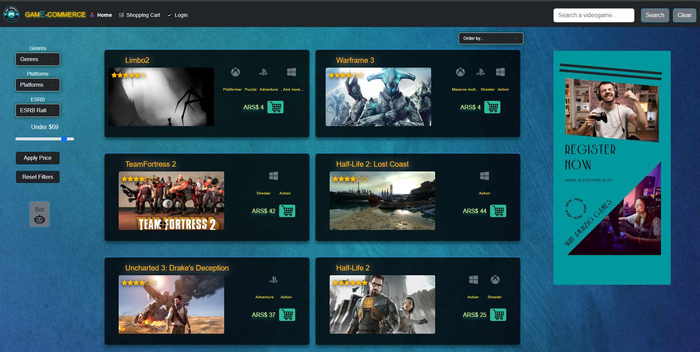
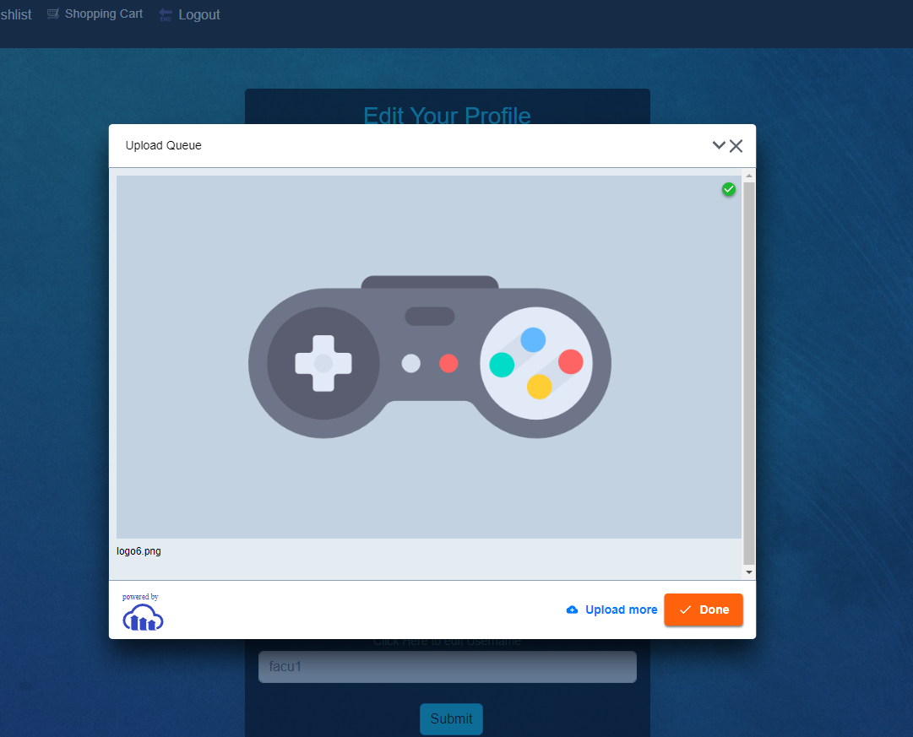

  

### Welcome to my GitHub Profile 👋

### I'm Facu!

I love computers, coding💻 , and music🎧.

I'm a FullStack Web Developer with formation in Pentest and Ethical Hacking. I've worked with NodeJS, React, Redux, SQL, Sequelize, Express, and several other technologies in the sector.
I offer positive attitude, predisposition and creativity for problem solving. I hope to further deepen my knowledge and acquire new skills.

<h2> Tech Skills: </h2>
JavaScript - HTML - CSS - React - Redux  
NodeJS - Express - PostgreSQL - Sequelize  
Git - Babel - Webpack - Cloudinary - Less - Bootstrap - JWT - Chatbot - SweetAlert

  <h2> Projects</h2>

    <a href="https://pokemon-pi-facucorona.vercel.app/"><h3>SoyHenry Pokédex 🤳</h3><a/>
    🚀 Technologies used: 
    React - Redux - NodeJS - Express - PostgreSQL - Sequelize
    

      
      
      
      
      
      
    

  

    <h3>GAME-COMMERCE 🕹️</h3>
    App made with Henry's teammates as our final project.
      

      
      

    🚀 Technologies used: 
    React - Redux - NodeJS - Express - PostgreSQL - Sequelize - Bootstrap - JWT - Nodemailer - Cloudinary - MercadoPago Checkout Pro - Chatbot -SweetAlert
    

      
      
      
      
      
      
      
      
      
    

  

<h2> 📫 How to reach me: </h2>

      
   

<!--
**facucorona** is a ✨ _special_ ✨ repository because its `README.md` (this file) appears on your GitHub profile.
Here are some ideas to get you started:
- 🔭 I’m currently working on ...
- 🌱 I’m currently learning ...
- 👯 I’m looking to collaborate on ...
- 🤔 I’m looking for help with ...
- 💬 Ask me about ...
- 📫 How to reach me: ...
- 😄 Pronouns: ...
- ⚡ Fun fact: ...
-->
